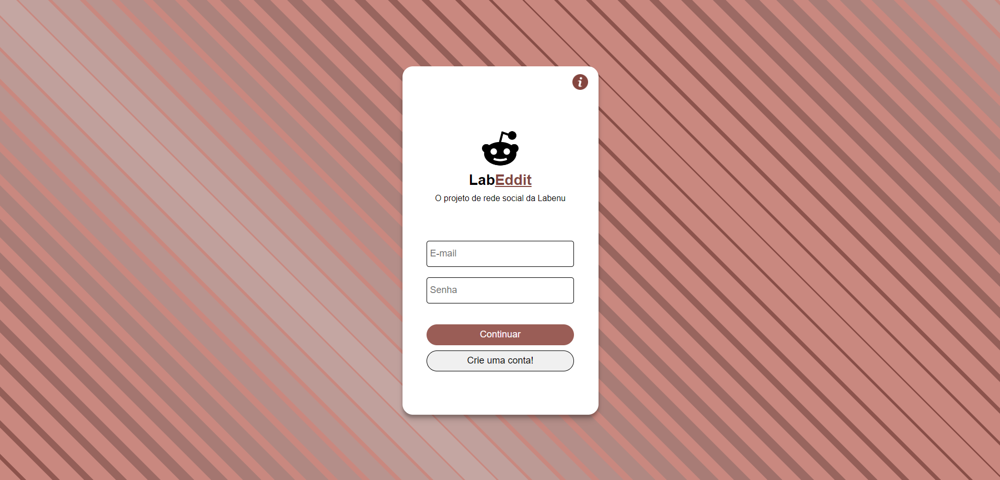
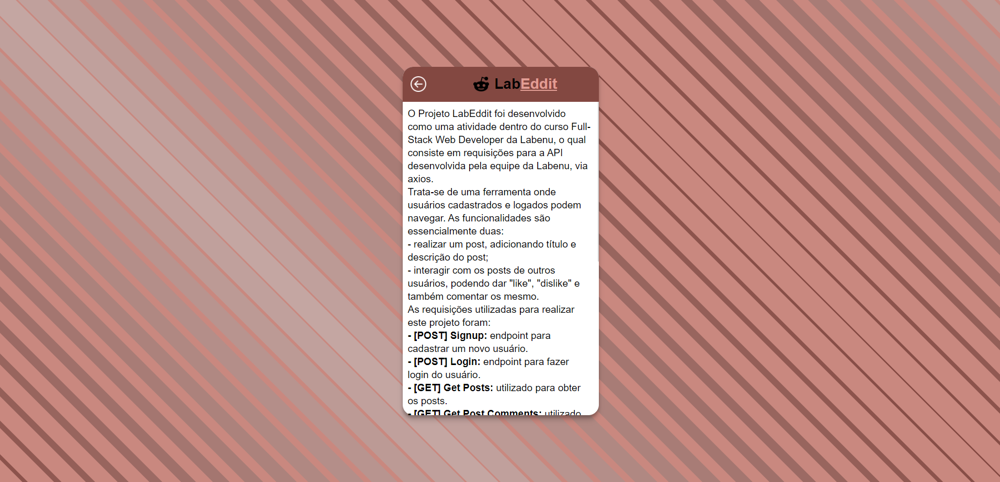
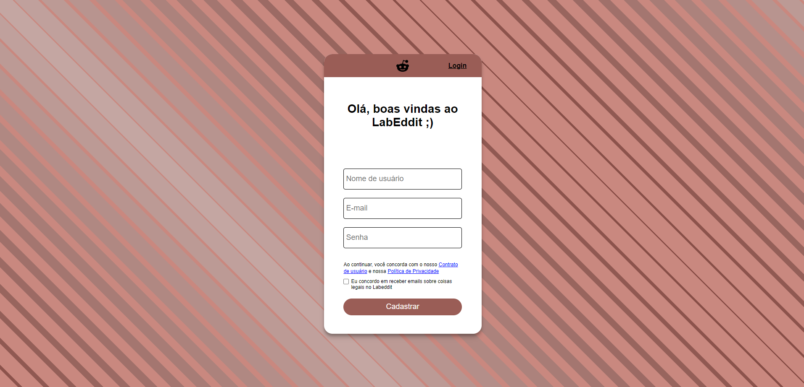
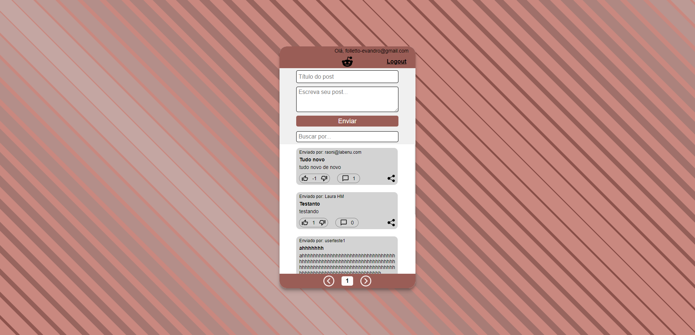
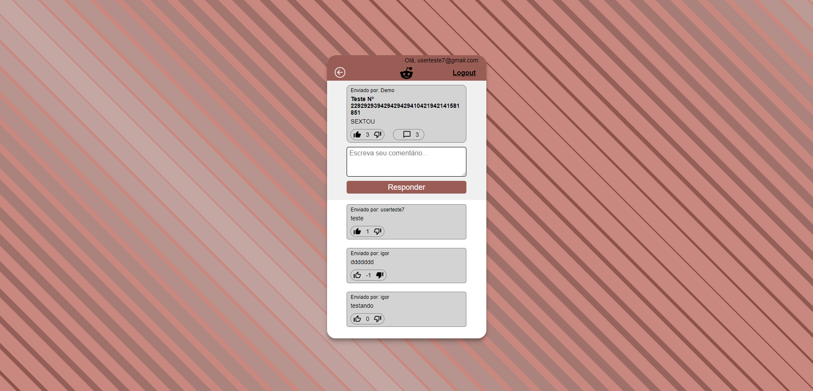

# `Projeto`
Projeto LabeX

# `Link`
https://folletto-labeddit.surge.sh

# `Descrição`
O Projeto LabEddit foi desenvolvido como uma atividade dentro do curso Full-Stack Web Developer da Labenu, o qual consiste em requisições para a API desenvolvida pela equipe da Labenu, via axios.

Trata-se de uma ferramenta onde usuários cadastrados e logados podem navegar. As funcionalidades são essencialmente duas:
- realizar um post, adicionando título e descrição do post;
- interagir com os posts de outros usuários, podendo dar "like", "dislike" e também comentar os mesmo.

As requisições utilizadas para realizar este projeto foram:

- **[POST] Signup:** endpoint para cadastrar um novo usuário.
- **[POST] Login:** endpoint para fazer login do usuário.
- **[GET] Get Posts:** utilizado para obter os posts.
- **[GET] Get Post Comments:** utilizado para carregar os comentários de um determinado post.
- **[POST] Create Post:** utilizado para criar um novo post.
- **[POST] Create Comment:** utilizado para comentar um determinado post.
- **[POST] Create Post Vote:** utilizado para dar "like" em um post.
- **[POST] Create Comment Vote:** utilizado para dar "like" em um comentário.
- **[PUT] Change Post Vote:** utilizado para dar "dislike" em um post.
- **[PUT] Change Comment Vote:** utilizado para dar "dislike" em um comentário.
- **[DEL] Delete Post Vote:** utilizado para deletar um "like" ou "dislike" de um post.
- **[DEL] Delete Comment Vote:** utilizado para deletar um "like" ou "dislike" de um comentário.
 

Desenvolvido por: Evandro Paulo Folletto
[Acessar repostório no GitHub](https://github.com/future4code/alves-Evandro-Folletto/pull/36)
[Acessar documentação da API](https://documenter.getpostman.com/view/9731983/U16eu7nT#intro)

# `Modo de usar`
Ao iniciar a ferramenta, o usuário é a página onde o usuário será direcionado depende da condição de estar ou não logado. Caso o usuário não esteja logado, ele é redirecionado
para a página de login. Nesta, o usuário deve fornecer o e-mail de cadastro e sua senha. No canto superior direito da página de login, existe um ícone de informação, onde o usuário pode clicar, e ao fazê-lo é exibida uma página de informações sobre o projeto. Também na página de login o usuário pode clicar em "Crir uma conta!".
 
Na página de criar uma conta, o usuário deve fornecer as informações de Nome do usuário, E-mail, Senha e aceitar os termos do contrato e política de privacidade.
 
Ao criar um cadastro, o usuário automaticamente estará logado (uma mensagem "Olá, [e-mail do usuário]" é mostrada no canto superior direito da tela) e será redirecionado para a página "Feed", onde existem os posts dos demais usuários. Nesta página, o usuário pode:
- criar um novo post, inserindo para tal um título e a descrição do post;
- buscar um post que contenha alguma palavra chave, seja no título ou no post em si;
- nos posts, o usuário pode dar "like" e "dislike" e ainda ver a informação de soma total de "likes" menos "dislikes", além de ver a quantidade de comentários que aquele determinado post tem;
- também no post, no canto inferior direito é apresentado um botão de "compartilhar", que ao ser clicado abre as opções de compartilhamento deste post nos aplicativos Twitter, WhatsApp e Telegram.
- na parte inferior da tela, está a informação de qual página o usuário se encontra atualmente. É possível carregar mais posts clicando em alguma das setas;
- no canto superior direito da tela, existe um botão "Logout" que permite o usuário deslogar da sua conta, e, ao fazê-lo o aplicativo redireciona para a tela de login;
- nos posts, é possível que o usuário clique no post em si, e então ele é redirecionado para a página de detalhes deste posts.
 
Na página de detalhes do post, o mesmo está fixado na parte de cima da página, é possível que o usuário:
- faça um comentário sobre este post, inserindo para tal apenas o texto;
- dar "like" e "dislike" no comentário que está fixado no topo;
- dar "like" e "dislike" nos comentários que estão abaixo;
- no canto superior esquerdo existe um ícone para voltar para a tela de Feed;
- no canto superior direito existe um botão "Logout" para o usuário deslogar da conta atual.

# `Paleta de cores utilizada`
.color1 { #834841 };
.color2 { #9a5d56 };
.color3 { #b2726b };
.color4 { #c9887f };
.color5 { #e19d94 };
.color6 { #c4a6a2 };

# `Instalando e rodando o projeto`
Fazer o clone do projeto:
- git clone link-do-repositório

Instalar as dependências:
- npm install

Rodar o projeto:
- npm run start

# `Tecnologias utilizadas`

# `Autor`
Evandro Paulo Folletto

# `Imagens`

