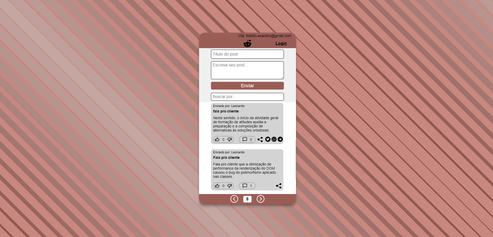

# `Projeto`
Projeto LabeX

# `Link`
https://folletto-labeddit.surge.sh

# `Descrição`
O Projeto LabEddit foi desenvolvido como uma atividade dentro do curso Full-Stack Web Developer da Labenu, o qual consiste em requisições para a API desenvolvida pela equipe da Labenu, via axios.

Trata-se de uma ferramenta onde usuários cadastrados e logados podem navegar. As funcionalidades são essencialmente duas:
- realizar um post, adicionando título e descrição do post;
- interagir com os posts de outros usuários, podendo dar "like", "dislike" e também comentar os mesmo.

As requisições utilizadas para realizar este projeto foram:

- **[POST] Signup:** endpoint para cadastrar um novo usuário.
- **[POST] Login:** endpoint para fazer login do usuário.
- **[GET] Get Posts:** utilizado para obter os posts.
- **[GET] Get Post Comments:** utilizado para carregar os comentários de um determinado post.
- **[POST] Create Post:** utilizado para criar um novo post.
- **[POST] Create Comment:** utilizado para comentar um determinado post.
- **[POST] Create Post Vote:** utilizado para dar "like" em um post.
- **[POST] Create Comment Vote:** utilizado para dar "like" em um comentário.
- **[PUT] Change Post Vote:** utilizado para dar "dislike" em um post.
- **[PUT] Change Comment Vote:** utilizado para dar "dislike" em um comentário.
- **[DEL] Delete Post Vote:** utilizado para deletar um "like" ou "dislike" de um post.
- **[DEL] Delete Comment Vote:** utilizado para deletar um "like" ou "dislike" de um comentário.
 

Desenvolvido por: Evandro Paulo Folletto
[Acessar repostório no GitHub](https://github.com/future4code/alves-Evandro-Folletto/pull/36)
[Acessar documentação da API](https://documenter.getpostman.com/view/9731983/U16eu7nT#intro)

# `Modo de usar`
Ao iniciar a ferramenta, o usuário pode escolher entre as opções "Listar viagens", "Área restrita" e "Sobre". 
 
a) Na opção "Sobre" é mostrada uma breve descrição do projeto.
 
b) A opção "Listar viagens" leva o usuário para uma página que contém uma lista de viagens cadastradas no sistema, com as seguintes informações: nome da viagem, descrição, planeta, duração (em dias) e data. Na parte superior é exibido um cabeçalho com as opções:
- um campo para buscar uma viagem por uma ou mais letras contida(as) no campo "planeta";
- um campo para ordenar a lista de viagens com as seguintes opções: ordem alfabética dos planetas, data das viagens (da mais recente para a menos recente) e por duranção de tempo da viagem (tanto em ordem crescente quanto decrescente);
- um campo para preencher a duração mínima de dias;
- um campo para preencher a duração máxima de dias.

Também é exibido um botão para voltar para a página inicial e outro para candidatar-se para uma viagem.
Ao clicar no botão "Inscrever-se" o usuário é redirecionado para um formulário de inscrição, onde deve preencher os seguintes campos: selecionar a viagem, nome, idade, texto de candidatura, profissão e país.
 
c) A opção "Área restrita" é a área do administrador, que requer que o mesmo esteja logado; caso não esteja, o mesmo é redirecionado para a página de login, onde deve fornecer os dados de e-mail e senha. Caso o usuário esteja logado, lhe é apresentada uma lista com as viagens cadastradas, assim como a opção de deletar e ver detalhes (para esta última opção basta clicar no nome). Caso o usuário clicar sobre o nome da viagem, ele é redirecionado para a página de detalhes desta, onde lhe são mostrados cards de informações de pessoas que requerem aprovação ou reprovação, para tal, basta o administrador clicar em reprovar ou aprovar. Em caso de aprovação o nome do usuário é apresentado na lista ao lado (lista de usuário aprovados). Ainda no Painel do Administrador é possível que este crie uma nova viagem, para tal, deve fornecer as seguintes informações: nome, planeta, data, descrição e duração (dias).

# `Paleta de cores utilizada`
.color1 { #834841 };
.color2 { #9a5d56 };
.color3 { #b2726b };
.color4 { #c9887f };
.color5 { #e19d94 };
.color6 { #c4a6a2 };

# `Instalando e rodando o projeto`
Fazer o clone do projeto:
- git clone link-do-repositório

Instalar as dependências:
- npm install

Rodar o projeto:
- npm run start

# `Tecnologias utilizadas`

# `Autor`
Evandro Paulo Folletto

# `Imagens`

