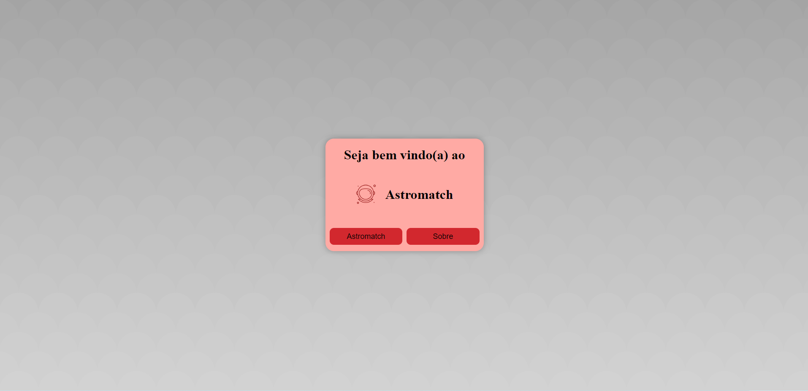
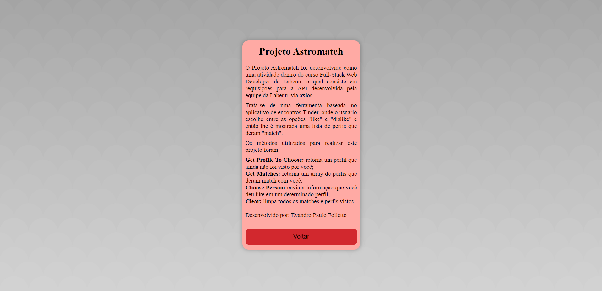
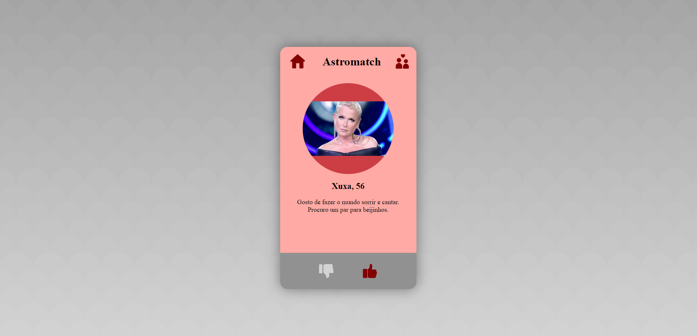
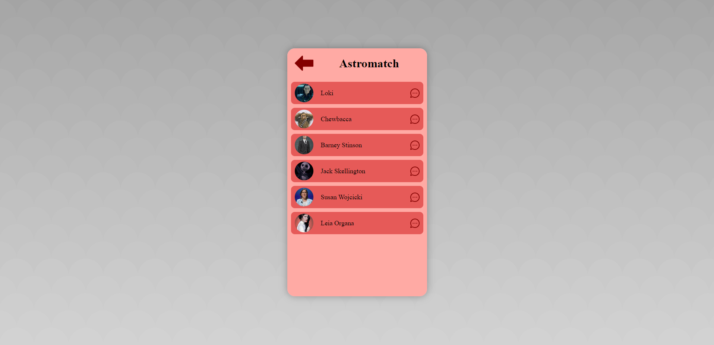

# Projeto
Projeto Astromatch

# Link
folletto-astromatch.surge.sh

# Descrição
O Projeto Astromatch foi desenvolvido como uma atividade dentro do curso Full-Stack Web Developer da Labenu, o qual consiste em requisições para a API desenvolvida pela equipe da Labenu via axios.  
Trata-se de uma ferramenta baseada no aplicativo de encontros Tinder, onde o usuário escolhe entre as opções "like" e "dislike" e então lhe é mostrada uma lista de perfis que deram "match".  
Os métodos utilizados para realizar este projeto foram:
Get Profile To Choose: retorna um perfil que ainda não foi visto por você;
Get Matches: retorna um array de perfis que deram match com você;
Choose Person: envia a informação que você deu like em um determinado perfil;
Clear: limpa todos os matches e perfis vistos.

# Modo de usar
Ao iniciar a ferramenta, o usuário pode escolher entre as opções "Sobre" e "Astromatch". Na opção "sobre" é mostrada uma breve descrição do projeto. Já a opção "Astromatch" leva o usuário para a aplicação em si.  
Nela, são listados perfis, um a um para o usuário e este tem a opção de dar "like" ou "disklike":
Caso o usuário optar por "dislike", nada ocorre e um novo perfil é mostrado na tela.
Caso o usuário optar por "like" e o perfil atual também deu "like" para o usuário (essa informação vem da API), uma mensagem de "match" é exibida na tela e este perfil é inserido em uma lista de matches (tarefa também feita pela API).  
No canto superior direito existe um ícone que leva o usuário para a tela de matches, e lá é exibida uma lista de matches. Caso a lista estiver vazia, uma mensagem indicando tal situação é mostrada.  
Ao finalizar a lista de perfis disponíveis, uma mensagem é exibida e o usuário deve resertar a lista e pode iniciar novamente o processo de "likes" e "dislikes".

# Instalando e rodando o projeto
Para usar localmente o projeto, basta:
- npm install
- npm run start

# Tecnologias utilizadas

# Autor
Evandro Paulo Folletto

# Imagens

