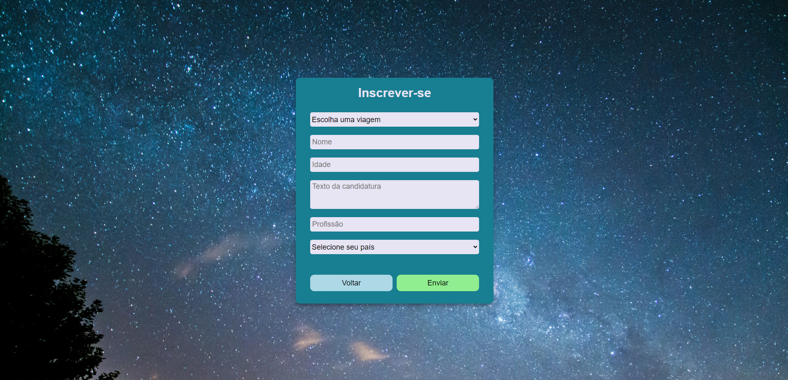

# `Projeto`
Projeto LabeX

# `Link`
https://folletto-labex.surge.sh

# `Descrição`
O Projeto LabeX foi desenvolvido como uma atividade dentro do curso Full-Stack Web Developer da Labenu, o qual consiste em requisições para a API desenvolvida pela equipe da Labenu, via axios.
Trata-se de uma ferramenta onde tanto usuários quanto administradores podem navegar:  
Os usuários podem verificar as viagens disponíveis e candidatar-se para as mesmas;  
Os administradores podem visualizar as viagens disponíveis, criar novas e detetar as existentes. Além disso, é possível ver detalhes das viagens, onde são apresentados os usuários que estão pendentes de aprovação/reprovação e também aqueles já foram aprovados.

As requisições utilizadas para realizar este projeto foram:
- **Get Trips:** retorna todas as viagens presentes no banco de dados;
- **Get Trip Detail:** retorna os detalhes de uma viagem específica (incluindo candidatos aprovados e os dependentes de aprovação/reprovação);
- **Create Trip:** endpoint que cria uma nova viagem.
- **Apply to Trip:** recebe informações de um candidato e o relaciona a uma viagem.
- **Delete Trip:** endpoint que deleta uma determinada viagem;
- **Login:** endpoint para fazer login de um usuário.
- **Decide Candidate:** endpoint para decidir a aprovação ou reprovação de um candidato para uma viagem.
- **Populate***: endpoint para popular o banco de dados para testes;
- **Signup***: endpoint utilizado para criar usuário admin.

*endpoints utilizados apenas em desenvolvimento
 

Desenvolvido por: Evandro Paulo Folletto
[Acessar repostório no GitHub](https://github.com/future4code/alves-Evandro-Folletto/pull/35)
[Acessar documentação da API](https://documenter.getpostman.com/view/9133542/TzCTZkQr#9416bc30-1a6c-4afe-9c45-c414f3353efd)

# `Modo de usar`
Ao iniciar a ferramenta, o usuário pode escolher entre as opções "Listar viagens", "Área restrita" e "Sobre". 
 
a) Na opção "Sobre" é mostrada uma breve descrição do projeto.
 
b) A opção "Listar viagens" leva o usuário para uma página que contém uma lista de viagens cadastradas no sistema, com as seguintes informações: nome da viagem, descrição, planeta, duração (em dias) e data. Na parte superior é exibido um cabeçalho com as opções:
- um campo para buscar uma viagem por uma ou mais letras contida(as) no campo "planeta";
- um campo para ordenar a lista de viagens com as seguintes opções: ordem alfabética dos planetas, data das viagens (da mais recente para a menos recente) e por duranção de tempo da viagem (tanto em ordem crescente quanto decrescente);
- um campo para preencher a duração mínima de dias;
- um campo para preencher a duração máxima de dias.
 
Também é exibido um botão para voltar para a página inicial e outro para candidatar-se para uma viagem.
Ao clicar no botão "Inscrever-se" o usuário é redirecionado para um formulário de inscrição, onde deve preencher os seguintes campos: selecionar a viagem, nome, idade, texto de candidatura, profissão e país.
 
c) A opção "Área restrita" é a área do administrador, que requer que o mesmo esteja logado; caso não esteja, o mesmo é redirecionado para a página de login, onde deve fornecer os dados de e-mail e senha. Caso o usuário esteja logado, lhe é apresentada uma lista com as viagens cadastradas, assim como a opção de deletar e ver detalhes (para esta última opção basta clicar no nome). Caso o usuário clicar sobre o nome da viagem, ele é redirecionado para a página de detalhes desta, onde lhe são mostrados cards de informações de pessoas que requerem aprovação ou reprovação, para tal, basta o administrador clicar em reprovar ou aprovar. Em caso de aprovação o nome do usuário é apresentado na lista ao lado (lista de usuário aprovados). Ainda no Painel do Administrador é possível que este crie uma nova viagem, para tal, deve fornecer as seguintes informações: nome, planeta, data, descrição e duração (dias).

# `Instalando e rodando o projeto`
Fazer o clone do projeto:
- git clone link-do-repositório

Instalar as dependências:
- npm install

Rodar o projeto:
- npm run start

# `Tecnologias utilizadas`

# `Paleta de cores utilizada`
.color0 { #77bccc };
.color1 { #5eb3c7 };
.color2 { #47a1b5 };
.color3 { #2f90a3 };
.color4 { #187e91 };
.color5 { #006c7f };

# `Autor`
Evandro Paulo Folletto

# `Imagens`

