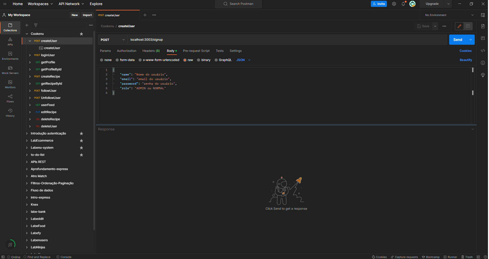
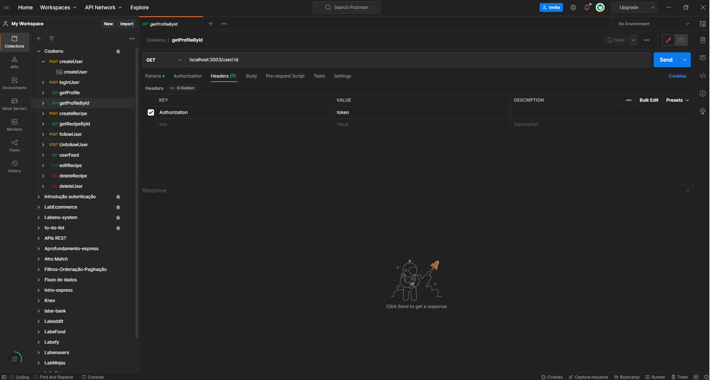
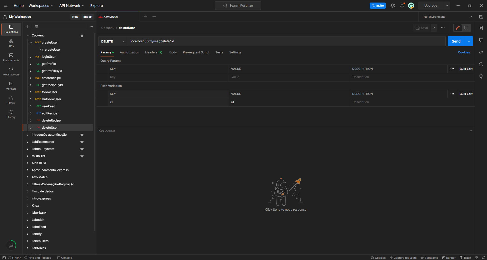

# `Projeto`
Cookenu

# `Descrição`
O Projeto Cookenu-backend foi desenvolvido como uma atividade dentro do curso Full-Stack Web Developer da Labenu, o qual consiste na elaboração de uma API que retorna dados conforme as requisições enviadas. Trata-se de uma ferramenta de cadastro de usuários e receitas.

A documentação da API pode ser acessada [aqui](https://documenter.getpostman.com/view/21552787/2s7YfLgvEB).

# `Modo de usar`
As requisições que podem ser feitas são:  
- **[POST] createUser:** cria um novo usuário, fornecendo (via body) nome, email, password e role.
- **[POST] loginUser:** faz o login em uma conta, fornecendo (via body) email e password.
- **[GET] getProfile:** busca os dados do perfil logado que está logado. Necessita de autenticação.
- **[GET] getProfileById:** busca os dados de um perfil, fornecendo (via path params) o ID deste. Necessita de autenticação.
- **[POST] createRecipe:** cria uma nova receita, fornecendo (via body) título e descrição. Necessita de autenticação.
- **[GET] getRecipeById:** busca uma receita, fornecendo (via path params) o ID desta. Necessita de autenticação.
- **[POST] followUser:** segue um usuário, fornecendo (via body) o ID deste. Necessita de autenticação.
- **[POST] UnfollowUser:** deixa de um usuário, fornecendo (via body) o ID deste. Necessita de autenticação.
- **[GET] userFeed:** busca todas as receitas dos usuários que o usuário logado segue. Necessita de autenticação.
- **[PUT] editRecipe:** edita uma receita, fornecendo (via body) o id da receita, título e descrição. Necessita de autenticação. Usuários "normais" só podem editar suas próprias receitas. Usuários "admin" podem alterar qualquer receita.
- **[DEL] deleteRecipe:** deleta uma receita, fornecendo (via path params) o ID desta. Usuários "normais" só podem deletar suas próprias receitas. Usuários "admin" podem deletar qualquer receita.
- **[DEL] deleteUser:** deleta um usuário, fornecendo (via path params) o ID deste.Necessita de autenticação e autorização. Somente usuários "admin" pode executar essa tarefa.

# `Instalando e rodando o projeto`
Fazer o clone do projeto:
- git clone link-do-repositório

Instalar as dependências:
- npm install

Rodar o projeto:
- npm run dev

# `Tecnologias utilizadas`

# `Autor`
Evandro Paulo Folletto  
 

# `Imagens`
Abaixo são mostradas algumas imagens de requisições:

### Requisição createUser:

### Requisição getProfileById:

### Requisição deleteUser:
