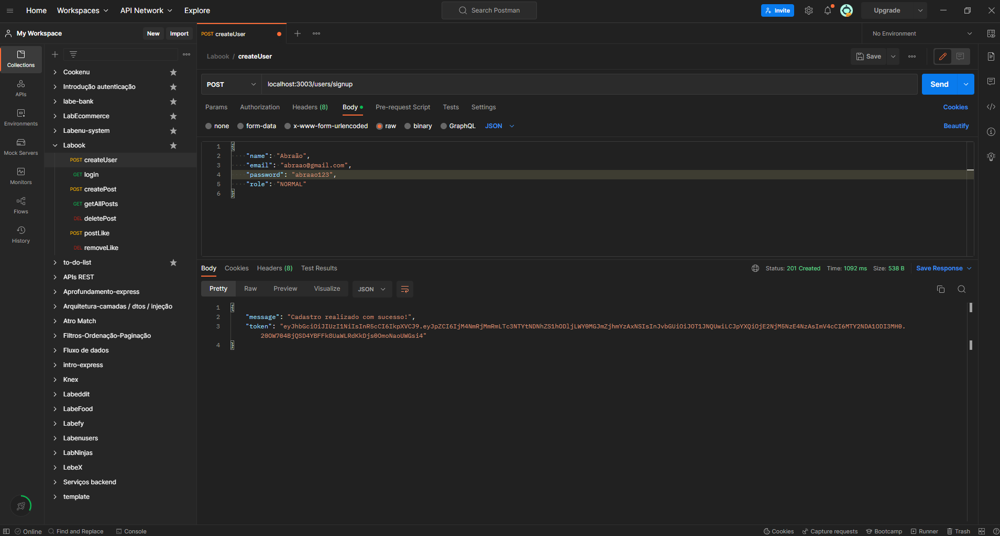
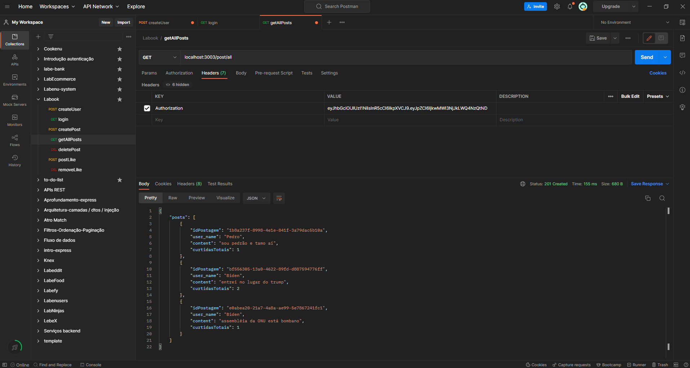
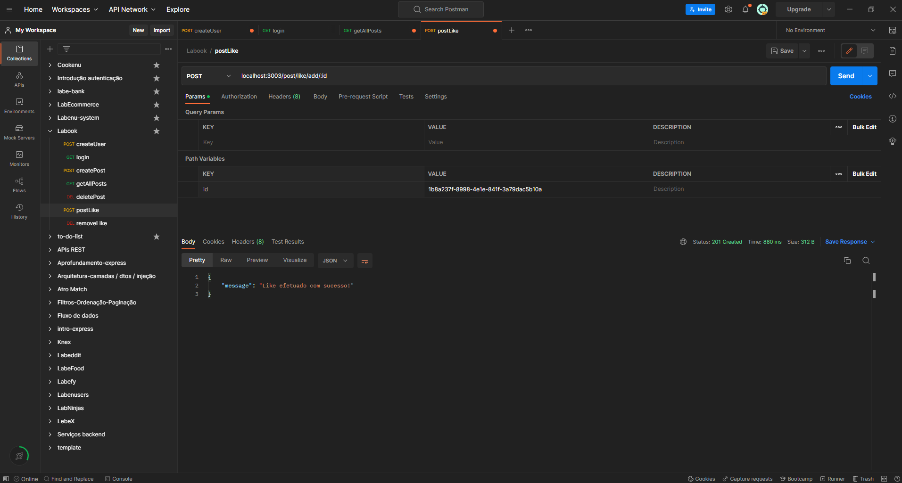

# `Projeto`
Labook

# `Descrição`
[Projeto desenvolvido na semana 21 do curso Labenu].  
O Projeto Labook-backend foi desenvolvido como uma atividade dentro do curso Full-Stack Web Developer da Labenu, o qual consiste na elaboração de uma API que retorna dados conforme as requisições enviadas. Trata-se de uma ferramenta de cadastro de usuários e posts.

A documentação da API pode ser acessada [aqui](https://documenter.getpostman.com/view/21552787/2s7ZT9Qjc8).

# `Modo de usar`
As requisições que podem ser feitas são:  

- **[POST] createUser:** cria um novo usuário, fornecendo (via body) nome, email, password e role.
- **[GET] login:** faz o login em uma conta, fornecendo (via body) email e password.
- **[POST] createPost:** criar um novo posto, fornecendo (via body) o conteúdo do post. Necessita de autenticação.
- **[GET] getAllPosts:** busca todos os posts. Necessita de autenticação.
- **[DEL] deletePost:** deleta um post, fornecendo (via path params) o id do post. Necessita de autenticação ou autorização.
- **[POST] postLike:** utilizado para dar "like" em um determinado post, fornecendo (via path params) o id do post. Necessita de autenticação.
- **[DEL] removeLike:** utilizado para dar "dislike" em um determinado post, fornecendo (via path params) o id do post. Necessita de autenticação.

# `Instalando e rodando o projeto`
Fazer o clone do projeto:
- git clone link-do-repositório

Instalar as dependências:
- npm install

Rodar o projeto:
- npm run dev

# `Tecnologias utilizadas`

# `Autor`
Evandro Paulo Folletto  
 

# `Imagens`
Abaixo são mostradas algumas imagens de requisições:

### Requisição createUser:

### Requisição getAllUsers:

### Requisição postLike:
