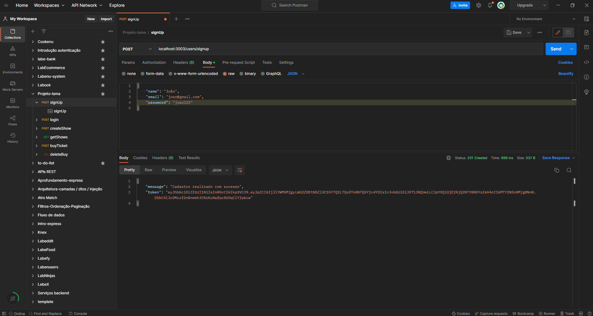
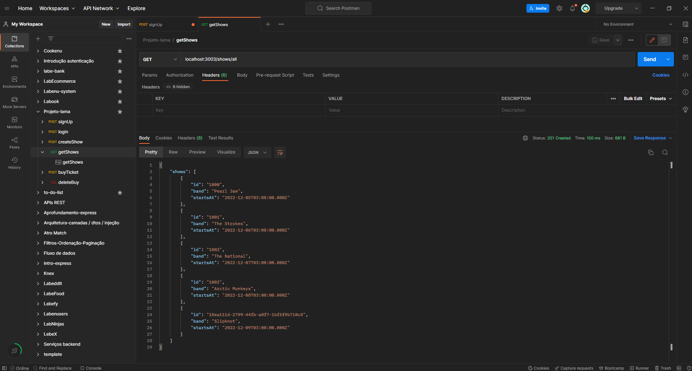
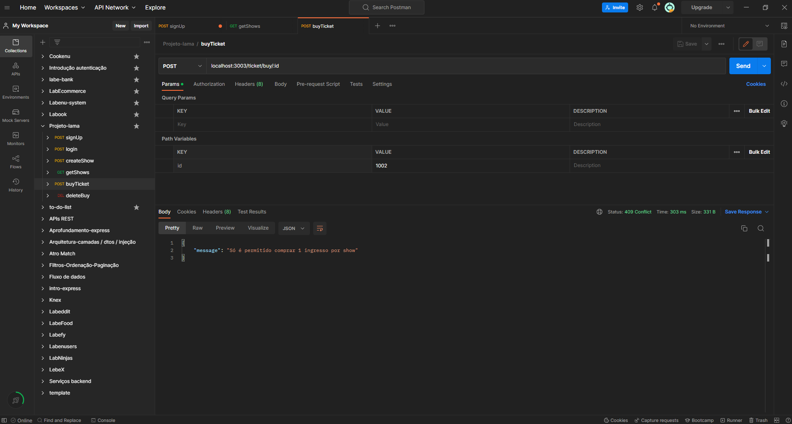

# `Projeto`
Lama

# `Descrição`
[Projeto desenvolvido na semana 22 do curso Labenu].  
O Projeto Lama-backend foi desenvolvido como uma atividade dentro do curso Full-Stack Web Developer da Labenu, o qual consiste na elaboração de uma API que retorna dados conforme as requisições enviadas. Trata-se de uma ferramenta de cadastro de usuários, shows e reserva de compras de ingressos. Neste projeto foram utilizados conceitos de testes unitários utilizando Jest.

A documentação da API pode ser acessada [aqui](https://documenter.getpostman.com/view/21552787/2s83tDpsrR).

# `Modo de usar`
As requisições que podem ser feitas são:  

- **[POST] signUp:** cria um novo usuário, fornecendo (via body) nome, email e password.
- **[POST] login:** faz o login em uma conta, fornecendo (via body) email e password.
- **[POST] createShow:** criar um novo show, fornecendo (via body) a banda e a data de apresentração. Necessita de autenticação e autorização de ADMIN.
- **[GET] getShows:** busca todos os shows cadastrados.
- **[POST] buyTicket:** faz a reserva de compra de ingresso, fornecendo (via path params) o id do show. Necessita de autenticação.
- **[DEL] deleteBuy:** deleta uma reserva de compra de ingresso, fornecendo (via path params) o id da reserva. Necessita de autenticação.

# `Instalando e rodando o projeto`
Fazer o clone do projeto:
- git clone link-do-repositório

Instalar as dependências:
- npm install

Criar o arquivo .env na raiz do projeto, com os dados:
  PORT = 3003
  DB_HOST = adicionar o endereço do localhost
  DB_USER = adicionar o user
  DB_PASSWORD = adicionar a senha
  DB_DATABASE = adicionar o schema
  JWT_KEY = chave usada para gerar o token
  JWT_EXPIRES_IN = tempo de expiração do token
  BCRYPT_SALT_ROUNDS = parâmetro salt utilizado pelo Bcrypt

Rodar o projeto:
- npm run dev

# `Tecnologias utilizadas`

# `Autor`
Evandro Paulo Folletto  
 

# `Imagens`
Abaixo são mostradas algumas imagens de requisições:

### Requisição signUp:

### Requisição getShows:

### Requisição buyTicket:
