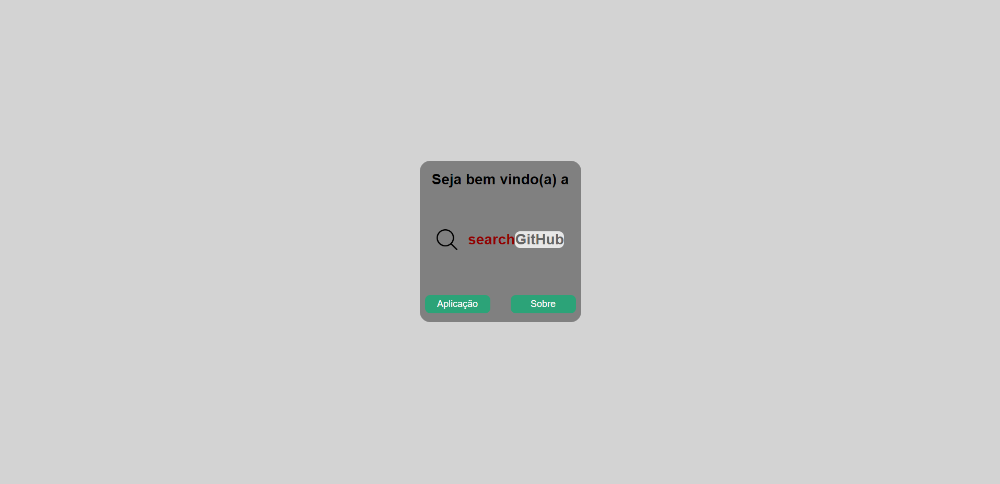
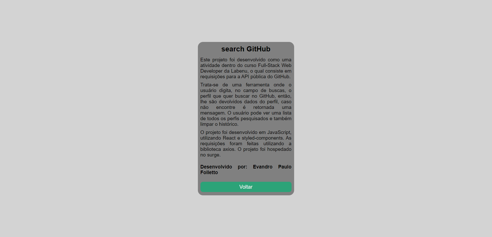
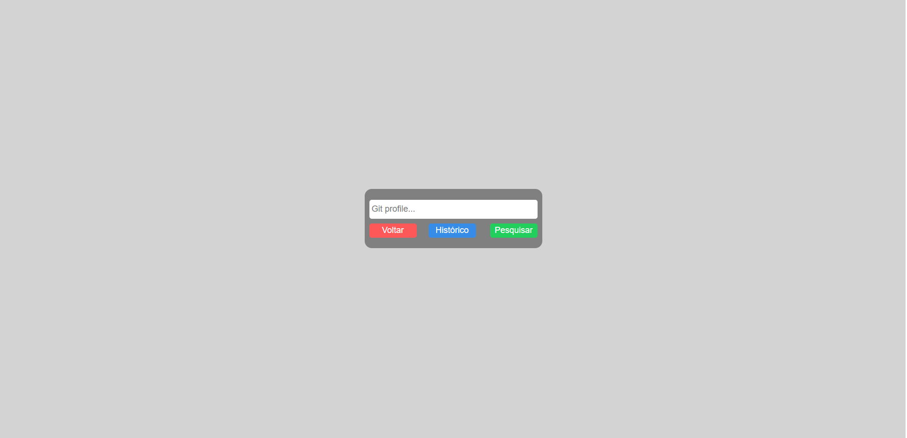
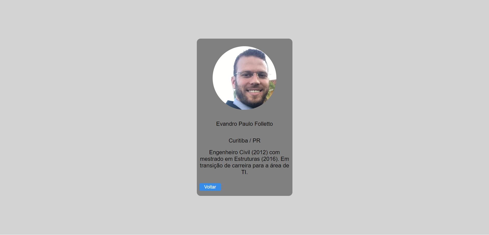
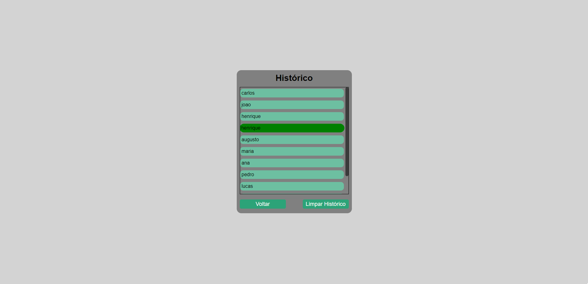
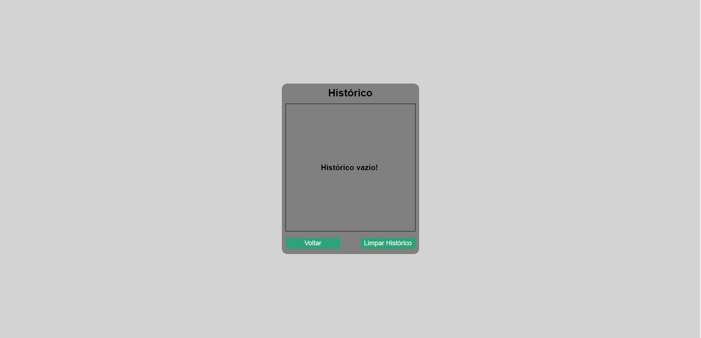

# `Projeto`
searchGitHub

# `Link`
[Clique aqui!](https://folletto-searchgithub.surge.sh/)

# `Descrição`
O Projeto searchGitHub foi desenvolvido como uma atividade dentro do curso Full-Stack Web Developer da Labenu, o qual consiste em requisições para a API pública do GitHub.

Trata-se de uma ferramenta onde o usuário digita, no campo de buscas, o perfil que quer buscar no GitHub, então, lhe são devolvidos dados do perfil, caso não encontre é retornada uma mensagem. O usuário pode ver uma lista de todos os perfis pesquisados e também limpar o histórico.
 

# `Modo de usar`
Ao iniciar a ferramenta, o usuário é direcionado para a página inicial, composta por um texto de boas vindas e dois botões: o botão "Sobre" direciona para uma página composta por um pequeno resumo sobre o projeto e o botão "Aplicação" redireciona para a página da aplicação em si.

A página da aplicação é composta por um campo de busca onde o usuário pode digitar o nome do perfil que deseja buscar e três botões: 
- "Voltar": redireciona para a página inicial de boas vindas.
- "Histórico": redireciona o usuário para o histórico de usuários que ele pesquisou.
- "Pesquisar": executa a pesquisa.

Caso o perfil que o usuário digitou foi encontra, o mesmo é mostrado na tela. Caso o perfil não foi encontrado, uma mensagem é mostrada.

Na página de histórico, são listados os perfis que o usuário pesquisou e que foram encontrados na plataforma. Os perfis estão listados de acordo com a data de pesquisa: no topo da lista está o perfil mais recentemente pesquisado. Ainda, é exibido um botão "Limpar histórico", onde é possível deletar todos os perfis do histórico.

# `Instalando e rodando o projeto`
Fazer o clone do projeto:
- git clone link-do-repositório

Instalar as dependências:
- npm install

Rodar o projeto:
- npm run start

# `Tecnologias utilizadas`

# `Autor`
Evandro Paulo Folletto
 
  
 

# `Imagens`

### Tela Inicial

### Tela Sobre

### Tela Searches

### Tela Profile

### Tela histórico

### Tela histórico vazio

